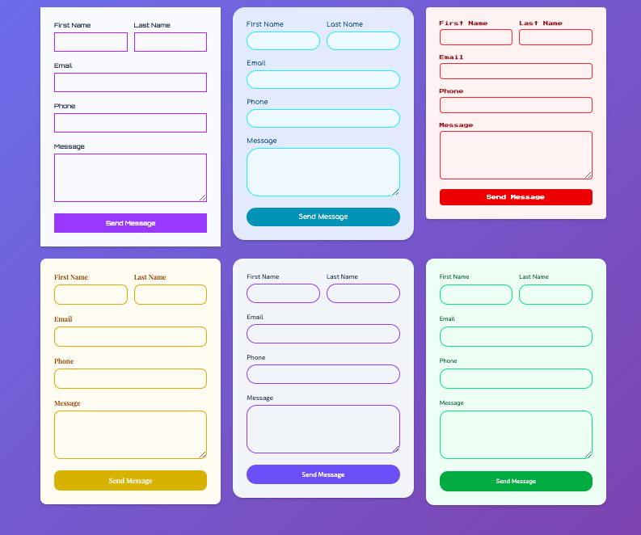
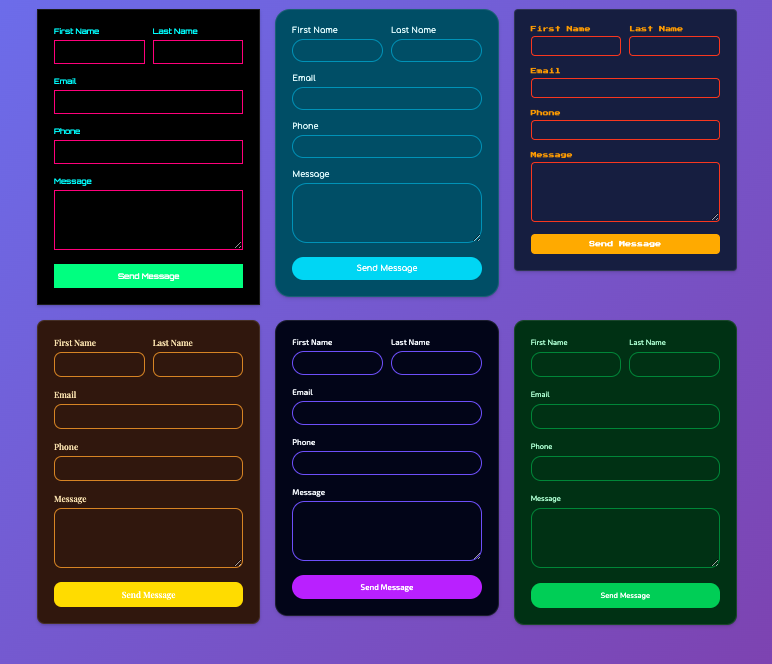

# Minimalist Contact Form Web Component

A lightweight, customizable web component for collecting contact inquiries. This component provides a clean, professional contact form with built-in validation and modern styling that can be embedded anywhere.






## Features

- **Shadow DOM Encapsulation**: Styles and DOM are isolated from the rest of the page
- **Built-in Validation**: Client-side validation with real-time feedback
- **Phone Number Formatting**: Automatic formatting using Cleave.js (XXX-XXX-XXXX)
- **Email Validation**: Proper email format validation
- **Responsive Design**: Works on all device sizes
- **Customizable Styling**: Configurable colors, fonts, and themes
- **Universal Theme Detection**: Automatically detects dark/light mode from system preferences or common website theme patterns (data-theme, dark class, etc.)
- **Loading States**: Visual feedback during form submission
- **Error Handling**: Graceful error handling with user-friendly messages

## Installation

#### Via CDN (preferred)

```html
<script src="https://raw.githack.com/DevManSam777/minimalist-contact-form/main/contact-form.js" defer></script>
```

#### Alternatively 
1. Download the contact form component files
2. Include them in your HTML file:

```html
<!-- CSS -->
<style>
  /* Your page styles */
</style>

<!-- HTML -->
<contact-form
  endpoint="https://your-api-endpoint.com/api/leads"
  success-message="Thanks! We'll get back to you soon."
></contact-form>

<!-- JavaScript -->
<script src="path/to/contact-form.js" defer></script>
```

## Basic Usage

Add the contact form to your HTML:

```html
<contact-form></contact-form>
```

## Customization

### API Endpoint

Set a custom API endpoint for form submission:

```html
<contact-form endpoint="https://your-api-endpoint.com/api/leads"></contact-form>
```

### Custom Messages

```html
<contact-form
  endpoint="https://your-api.com/contact"
  success-message="Message sent! 🎉"
  error-message="Oops! Please try again."
></contact-form>
```

### Custom Colors & Styling

```html
<contact-form
  endpoint="https://your-api.com/contact"
  primary-color="#6366f1"
  background-color="#ffffff"
  text-color="#374151"
  border-radius="12px"
></contact-form>
```
```

### Google Fonts

```html
<contact-form
  endpoint="https://your-api.com/contact"
  google-font="Inter"
  font-size="16px"
></contact-form>
```

### Dark Mode Support

```html
<!-- Automatic dark mode detection (detects system preference and website themes) -->
<contact-form
  endpoint="https://your-api.com/contact"
  dark-primary-color="#60a5fa"
  dark-background-color="#1f2937"
  dark-text-color="#f9fafb"
></contact-form>
```

## Available Attributes

| Attribute | Description | Default |
|-----------|-------------|---------|
| `endpoint` | API endpoint URL for form submission | Required |
| `primary-color` | Main button/accent color | `#3b82f6` |
| `background-color` | Form background color | `#ffffff` |
| `text-color` | Text color | `#374151` |
| `border-color` | Input border color | `#d1d5db` |
| `border-radius` | Corner roundness | `6px` |
| `font-family` | Custom font family | System fonts |
| `font-size` | Base font size | `14px` |
| `google-font` | Google Font name | None |
| `success-message` | Custom success message | `Thank you! Your message has been sent.` |
| `error-message` | Custom error message | `Sorry, there was an error. Please try again.` |
| `dark-primary-color` | Primary color for dark mode | `#60a5fa` |
| `dark-background-color` | Background color for dark mode | `#1f2937` |
| `dark-text-color` | Text color for dark mode | `#f9fafb` |
| `dark-border-color` | Border color for dark mode | `#4b5563` |

## Form Fields

The contact form includes the following fields:

- **First Name** (required) - Minimum 1 character
- **Last Name** (required) - Minimum 1 character  
- **Email** (required) - Valid email format
- **Phone** (required) - Formatted as XXX-XXX-XXXX
- **Message** (required) - Minimum 1 character

## Validation

The component includes comprehensive validation:

- **Real-time validation**: Fields are validated on blur and re-validated on input
- **Visual feedback**: Invalid fields show red borders and error messages
- **Valid fields**: Show green borders when properly filled
- **Form submission**: Prevents submission until all validation passes
- **Phone formatting**: Automatically formats phone numbers as you type

## Form Data Structure

The form submits the following data structure to your API:

```javascript
{
  // Core form fields (user input)
  firstName: "John",
  lastName: "Doe", 
  email: "john@example.com",
  phone: "555-123-4567",
  message: "Hello, I'm interested in your services..."
}
```

## Form Data Structure

The form submits the following data structure to your API:

```javascript
{
  // Core form fields (user input)
  firstName: "John",
  lastName: "Doe", 
  email: "john@example.com",
  phone: "555-123-4567",
  message: "Hello, I'm interested in your services..."
}
```

### Complete Data Structure (DevLeads Integration)

For compatibility with DevLeads, the component sends a complete data structure with default values. You can modify the component HTML to add input fields for any of these additional fields:

```javascript
{
  // User-entered data
  firstName: "John",
  lastName: "Doe", 
  email: "john@example.com",
  phone: "555-123-4567",
  message: "Hello, I'm interested in your services...",
  
  // DevLeads integration fields - auto-generated
  businessName: "John Doe", // Combines first + last name
  
  // DevLeads integration fields - optional business fields (add inputs for these if needed)
  businessPhone: "",
  businessPhoneExt: "",
  businessEmail: "",
  businessServices: "",
  phoneExt: "",
  textNumber: "",
  
  // DevLeads integration fields - service preferences
  preferredContact: "email",
  serviceDesired: "Web Development",
  hasWebsite: "no",
  websiteAddress: "",
  
  // DevLeads integration fields - billing address (with defaults)
  billingStreet: "N/A",
  billingAptUnit: "",
  billingCity: "N/A", 
  billingState: "N/A",
  billingZipCode: "00000",
  billingCountry: "USA",
  billingAddress: {
    street: "N/A",
    aptUnit: "",
    city: "N/A",
    state: "N/A",
    zipCode: "00000",
    country: "USA"
  },
  
  // DevLeads integration fields - system flag
  isFormSubmission: true
}
```

## Server-Side Requirements

The component sends data to the specified API endpoint via a POST request with:

- **Method**: POST
- **Content-Type**: application/json
- **Request Body**: JSON object containing all form fields

The server should respond with:
- **Success**: 200/201 status code
- **Error**: 4xx/5xx status code with optional error message

## Styling Examples

### Modern Glassmorphism
```html
<contact-form
  endpoint="https://your-api.com/contact"
  primary-color="#6366f1"
  background-color="rgba(255, 255, 255, 0.9)"
  border-radius="16px"
  google-font="Inter"
></contact-form>
```

### Dark Theme
```html
<contact-form
  endpoint="https://your-api.com/contact"
  primary-color="#3b82f6"
  background-color="#1f2937"
  text-color="#f9fafb"
  border-color="#4b5563"
  border-radius="8px"
></contact-form>
```

### Colorful Design
```html
<contact-form
  endpoint="https://your-api.com/contact"
  primary-color="#10b981"
  background-color="#ffffff"
  text-color="#374151"
  border-radius="0"
  font-size="16px"
  google-font="Poppins"
></contact-form>
```

## Browser Compatibility

This component uses modern web standards:
- Custom Elements v1
- Shadow DOM v1
- ES6+ features
- Fetch API

Compatible with all modern browsers (Chrome, Firefox, Safari, Edge).

## Dependencies

The component dynamically loads:
- [Cleave.js](https://github.com/nosir/cleave.js) for phone number formatting

## Error Handling

The component handles various error scenarios:
- **Network errors**: Displays user-friendly network error messages
- **Server errors**: Shows server response errors to users
- **Validation errors**: Prevents submission and highlights invalid fields
- **Browser compatibility**: Graceful degradation for older browsers

## Performance

- **Lightweight**: Minimal footprint with no external dependencies (except Cleave.js)
- **Lazy loading**: Google Fonts and Cleave.js are loaded only when needed
- **Efficient rendering**: Uses Shadow DOM for optimal performance
- **Memory management**: Properly cleans up event listeners

## Accessibility

- **Semantic HTML**: Uses proper form elements and labels
- **ARIA support**: Includes appropriate ARIA attributes
- **Keyboard navigation**: Full keyboard accessibility
- **Screen reader friendly**: Works with assistive technologies
- **Focus management**: Clear focus indicators

## Integration Examples

### With Vercel Functions
```javascript
// api/contact.js
export default async function handler(req, res) {
  if (req.method !== 'POST') {
    return res.status(405).json({ message: 'Method not allowed' });
  }

  const formData = req.body;
  
  // Process the form data
  // Send emails, save to database, etc.
  
  return res.status(200).json({ message: 'Success!' });
}
```

### With Netlify Functions
```javascript
// netlify/functions/contact.js
exports.handler = async (event, context) => {
  const formData = JSON.parse(event.body);
  
  // Process the form data
  
  return {
    statusCode: 200,
    body: JSON.stringify({ message: 'Success!' })
  };
}
```

## Need a complete backend solution?

Check out our compatible server implementation:
- [Contact Form Server](https://github.com/DevManSam777/forms-server)
- Includes email notifications, database storage, and more

## License

[MIT License](LICENSE)

Copyright (c) 2025 DevManSam